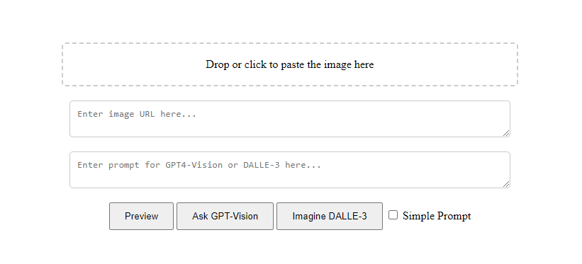

# gpt4-api-playground
gpt4-vision and dalle-3 api playground.



* [GPT-4-Vision](https://platform.openai.com/docs/guides/vision)
  * Input only supports url and base64 data.
  * You can click, drop, or paste the image directly. The app will convert it to base64 data.
* [DALL-E 3](https://platform.openai.com/docs/guides/images)
  * If **Simple Prompt** is checked, the app will add a sentence before your prompt. ([Read More](https://platform.openai.com/docs/guides/images/prompting))

# Getting Started

Install dependencies:
```
pip install -r requirements.txt
```

Create a `.env` file and add a line:
```
OPENAI_API_KEY=<your_openai_key>
```

To launch the app:
```
python.exe .\app.py
```

---
The HTML part of the code is almost written by GPT-4.